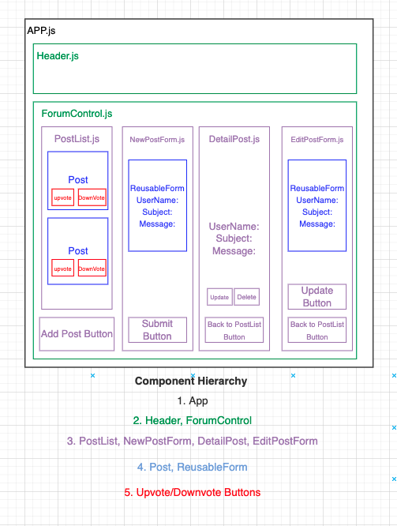

#  
 🍺 **Tap Room** 🍺 

#### By _**Cesar Lopez, Phil Curran, Joathan Delcid, and Brit Wallace**_

#### A React app that tracks kegs of beer and includes details like price, and alcohol percentage. 

## Technologies Used

* _HTML_
* _CSS_
* _Javascript_
* _React_
* _Node Package Manager (npm)_
* _Webpack_
* _ESlint_

## Description

_A React app that ._

## Component Diagram

## Setup/Installation Requirements

* _Clone this repository from https://github.com/wowgr8/epicodus-forum.git_
* _Open project in the code editor of your choice._
* _In the root directory enter the command npm install_
* _Run: npm install animate.css --save to get animation.
* _Run: npm start to view in the browser._

## Known Bugs

* _No known issues_

## Contact Me

_Let me know if you run into any issues or have questions, ideas or concerns. britwallace@gmail.com_

## License

_MIT_

Copyright (c) _June 2022_ _Brit Wallace